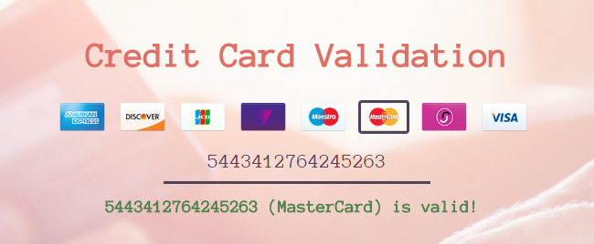

# CreditCardValidation
This script is designed to validate credit card number by checking its IIN prefix and checksum. Following credit card brands are supported:
<ul>
<li>American Express</li>
<li>Discover Card</li>
<li>JCB</li>
<li>Laser</li>
<li>Maestro</li>
<li>MasterCard</li>
<li>VISA</li>
</ul>
  

  
View on <a href="http://www.gerayzade.me/apps/ccv/" target="_blank">gerayzade.me</a>
